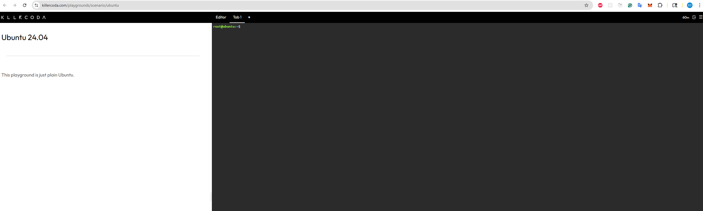
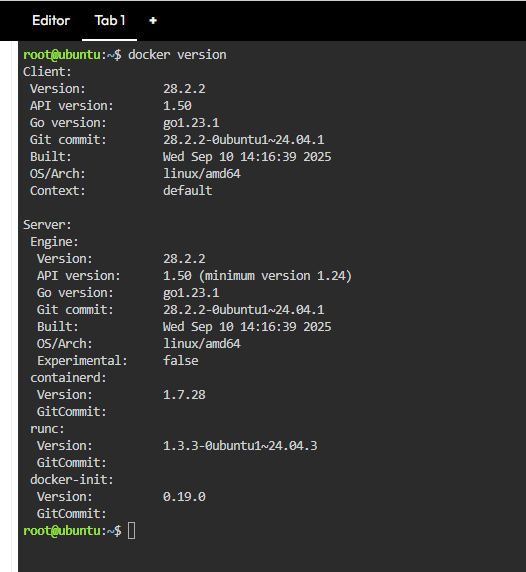
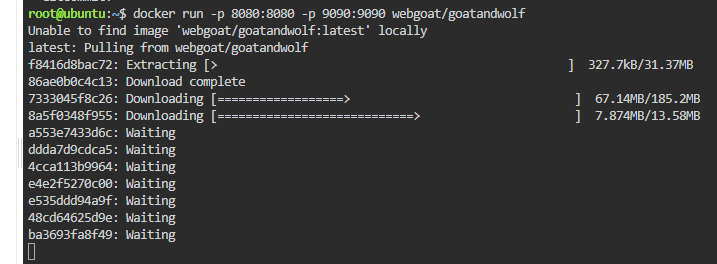
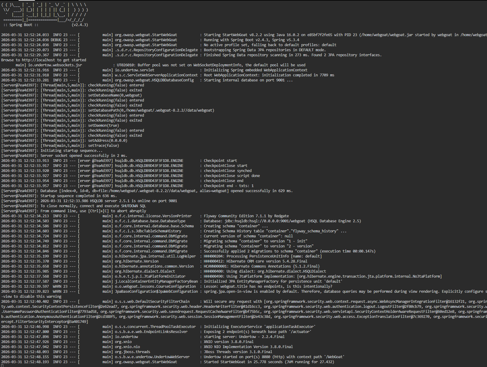
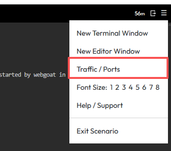
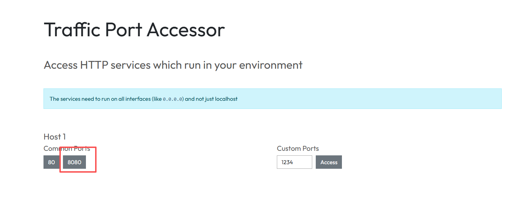
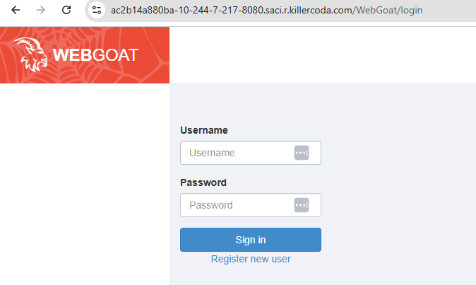

## Objective
Understand SQL Injection and how to prevent it.

For this practice, you will need to be able to edit form fields before submitting them.
This is a basic and common technique that attackers use to test websites for vulnerabilities.

We will use the [Chrome Browser](https://www.google.com/chrome/browser/desktop/index.html) for this lab. 

[WebGoat](https://owasp.org/www-project-webgoat/) is a deliberately insecure web application maintained by [OWASP](http://www.owasp.org/) designed to teach web application security lessons.

This program is a demonstration of common server-side application flaws. The exercises are intended to be used by people to learn about application security and penetration testing techniques.

<span style="color:red">**WARNING:exclamation:**</span> While running this program your machine will be extremely vulnerable to attack.

So <span style="color:red">**DO NOT**</span> run it using your machine, run it on [KillerCoda](https://killercoda.com/playgrounds/scenario/ubuntu) instead.

Go to [KillerCoda](https://killercoda.com/playgrounds/scenario/ubuntu), 
<b>Note:</b> The maximum duration for each session is 60 minutes.



### Step1: Check your docker version
Access the Killercoda Ubuntu Playground:

👉 https://killercoda.com/playgrounds/scenarios/ubuntu

Once the terminal is ready, verify that Docker is running:
```bash
docker version
```
 <br/>


### Step2: Start WebGoat
Run this command 
```
docker run -p 8080:8080 -p 9090:9090 webgoat/goatandwolf
```

You should see a bunch of output that ends in something like this:
<br/>
 <br/>
 <br/>
<b>Note:</b> There might be some 'warnings' at the end. No need to be worried if you see/don't see the warnings. 


To access the web interface, follow these steps: - Click the **menu icon (☰)** in the top-right corner - Select **"Traffic / Ports"** - Click on port **8080** (or manually enter it under Custom Ports)
<br/>
 <br/>
 <br/>


That 8080 is a link, click on it. This should take you to a URL that looks something like:

https://cb5c962196fb-10-244-7-104-8080.saci.r.killercoda.com/


You **should get an error** on this page. In your browser's address bar, append **/WebGoat/** to the end of the URL and hit enter.

For example: https://cb5c962196fb-10-244-7-104-8080.saci.r.killercoda.com/WebGoat

You should now see something like this:



Register a new user and login


### Step3: SQL Injection Practice

* In the left-hand menu, click on **(A1) Injection -> SQL Injection (intro)**.

    

    You can start attempting these labs by completing few of the stages.

* You will get full points if you finish some of the stages in `SQL Injection (intro)`

## Submission

Do your best and complete any number of stages in `SQL Injection (intro)`, take a screenshot `yourPID.png` and submit it to Canvas `Homework 6`
